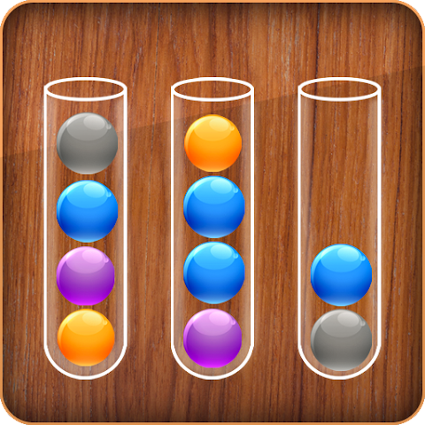
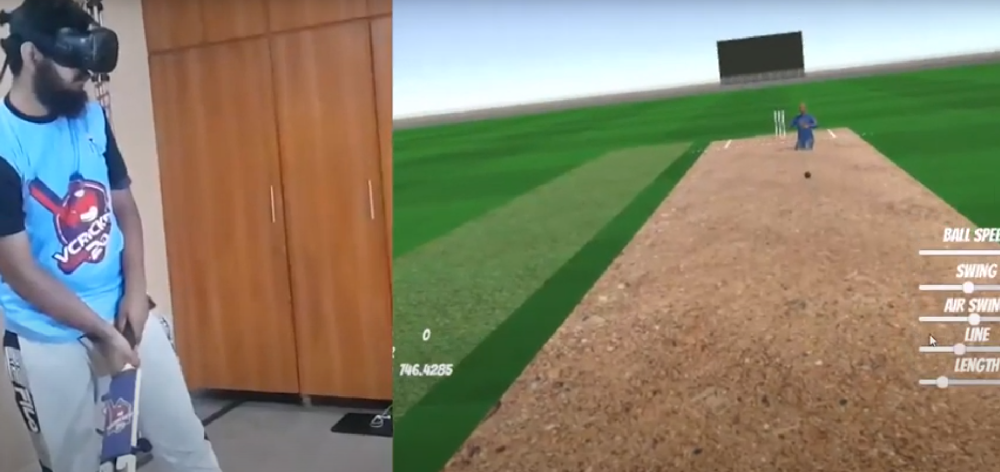
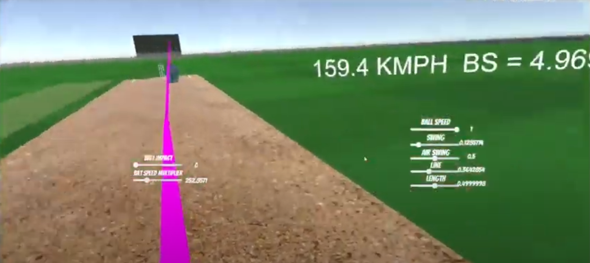

# VR Cricket Championship

**Step into the exhilarating world of cricket like never before with VR Cricket Championship! Experience cricket in a groundbreaking virtual reality setup crafted by XREV Studio.**

## 📌 Table of Contents

1. [About the Project](#about-the-project)
2. [Game Details](#game-details)
3. [Installation](#installation)
4. [Usage](#usage)
5. [Contribution](#contribution)
6. [License](#license)
7. [Contact](#contact)
8. [Acknowledgements](#acknowledgements)

## 🎮 About the Project

The VR Cricket Championship is not just a game but a revolution in the world of virtual reality gaming. Get ready to immerse yourself in the most realistic virtual cricket championship ever created. From batting, bowling to fielding, every aspect of the game mirrors real-life physics and dynamics, offering an unmatched cricketing experience.

## 🏏 Game Details

### Description

- **Physics-Based Gameplay**: Experience a cricket simulation with realistic ball physics and dynamic gameplay.
- **Multi-Dimensional Gameplay**: Develop your cricketing skills in all dimensions – batting, bowling, and fielding.
- **Interactive Environments**: Immerse yourself in interactive stadiums with lifelike crowd animations and ambience.

### Key Features

- **360° VR Cricket Experience**: A complete immersion into the cricket field with 360° VR technology.
- **Realistic Graphics**: Enjoy high-definition graphics that bring every detail of the cricket world alive.
- **Epic Narrative**: Embark on a journey from being a novice to becoming a cricket legend.

### Gallery

## 💻 Installation

**Instructions to get the project up and running:**

1. **Requirements**
   - VR headset (e.g., Oculus Rift, HTC Vive)
   - Compatible PC or gaming console
2. **Setup**
   - Download the VR Cricket Championship setup file from the releases section.
   - Install the game following the on-screen instructions.

## 🕹️ Usage

**Here's how to get started with the VR Cricket Championship:**

1. Launch the game from your desktop or VR home.
2. Follow the in-game tutorial to get acquainted with the controls and gameplay.
3. Start your cricketing journey in the training ground and make your way up to the championship league.

## 🤝 Contribution

We welcome contributions from the community. If you'd like to contribute, please fork the repository and create a new pull request.

## 📄 License

Distributed under the XYZ License. See `LICENSE` for more information.

## 📞 Contact

XREV Studio
- Email: contact@xrevstudio.com
- Twitter: [@XREVStudio](https://twitter.com/XREVStudio)

## 👏 Acknowledgements

- [Oculus SDK](https://developer.oculus.com/)
- [Unity Engine](https://unity.com/)
